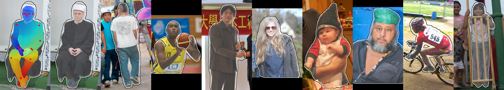
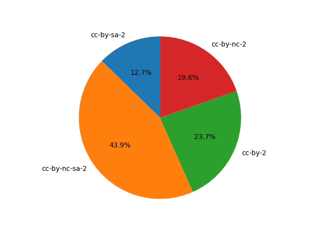

# Flickr Diverse Humans - FDH
The Flickr Diverse Humans (FDH) dataset consists of 1.87M images of human figures "in the wild".
FDH has a large diversity in terms of pose, age, ethnicity, occluding objects, accessories, and image background.
Each image contains a single human figure in the center, with a pixel-wise dense pose estimation from Continuous Surface Embeddings (CSE), 17 keypoint annotations from a keypoint R-CNN model, and a segmentation mask.



The dataset was crawled from the YFCC100M dataset ([YFCC-100M dataset](http://projects.dfki.uni-kl.de/yfcc100m/)) and automatically annotated.
See [our paper]() for more more details about the automatic annotation.


## Licenses
The images are collected from images in the YFCC-100M dataset and each image in our dataset is free to use for **academic** or **open source** projects.
For each body, the corresponding original license is given in the metadata. Some of the images require giving proper credit to the original author, as well as indicating any changes that were made to the images. The original author is given in the metadata.

The dataset contains images with the following licenses:
- [CC BY-NC-SA 2.0](https://creativecommons.org/licenses/by-nc-sa/2.0/): 816,664 Images (60 GB)
- [CC BY-SA 2.0](https://creativecommons.org/licenses/by-sa/2.0/): 236,633 Images (17 GB)
- [CC BY 2.0](https://creativecommons.org/licenses/by/2.0/): 440,855 Images (32 GB)
- [CC BY-NC 2.0](https://creativecommons.org/licenses/by-nc/2.0/): 365,344 Images (27 GB)

The FDH metadata is under [Apache 2.0 License](https://www.apache.org/licenses/LICENSE-2.0).

## Download

1. First, install dependencies:

```bash
pip install click, tqdm, webdataset==0.2.26
```

2. To download, run (expects python 3.6+): 

```
python download.py --target_directory data/fdh
```

3. If you want to download without embeddings:
```
python download_no_embeddings.py --target_directory data/fdh
```

## Metainfo
For each face in the dataset, follows the following metainfo:

```
{
    "author": "flickr_username",
    "cateogry": "val", # val or train
    "date_crawled": "2021-11-19",
    "unixtime_crawled": 1637341702.1145487,

    "date_taken": "2013-08-21 13:21:46.0",
    "date_uploaded": "1377635391", # Unix time when uploaded
    "license": "Attribution-NonCommercial License",
    "license_url": "http://creativecommons.org/licenses/by-nc/2.0/",
    "photo_title": "original_photo_name", # Flickr photo title
    "photo_url": "http://www.flickr.com/photos/.../", # Original image URL
    "yfcc100m_line_idx": "0",
    "id": 0, # The FDH image ID.
    "user_nsid": "11111111@N01" #Flickr user id

}
```
## Changes from article
The released dataset is changed from our article in the following ways:
- The number of matching keypoints between the CSE embedding and R-CNN keypoints is reduced to 4.
- Included filtering of keypoints with respect to head. At least 2 keypoints corresponding to the head should match with either a "head" or "neck" CSE vertex. If a keypoint is outside the crop, we assume that it matches.

These changes increased the dataset size from 1.53M images to 1.87M images.  


## Statistics
#### Distribution of image licenses



## Citation
If you find the dataset useful, please cite the following:
```
@inproceedings{hukkelas23DP2,
  author={Hukkelås, Håkon and Lindseth, Frank},
  booktitle={2023 IEEE/CVF Winter Conference on Applications of Computer Vision (WACV)}, 
  title={DeepPrivacy2: Towards Realistic Full-Body Anonymization}, 
  year={2023},
  volume={},
  number={},
  pages={1329-1338},
  doi={10.1109/WACV56688.2023.00138}}
```

## Privacy
FDH consists of photos that are published for free use and redistribution by the respective authors.

To find out if your photo is included in FDH, we have included a script to search the dataset with your flickr User NSID.

To check if your user is included, run the script:
```
python3 search_user.py data/fdh/metadata.json --user_nsid=FLICKR_USER_NSID
```
The script will print all images that where published with the given user nsid.

To get your photo removed from FDH:

1. Go to Flickr and do one of the following:
    - Tag the photo with `no_cv` to indicate that you do not wish it to be used for computer vision research.
    - Change the license of the photo to `None` (All rights reserved) or any Creative Commons license with `NoDerivs` to indicate that you do not want it to be redistributed.
    - Make the photo private, i.e., only visible to you and your friends/family.
    - Get the photo removed from Flickr altogether.
2. Contact [hakon.hukkelas@ntnu.no](mailto:hakon.hukkelas@ntnu.no). Include your flicker User NSID in the mail.
